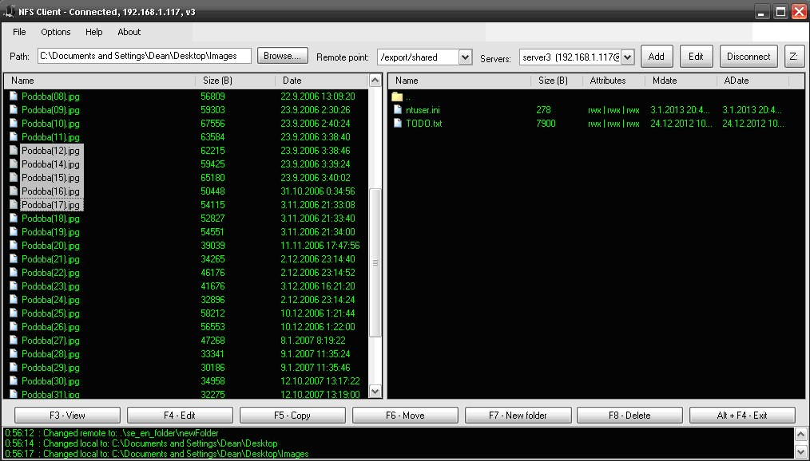

NFSClient
=========

NFSClient is an application for Microsoft Windows. It's an client for NFS server supporting protocols NFS 2, NFS 3 and NFS 4.1

It's written in C# language.

## Look

## Tested

Application is tested to work on Windows XP (32bit) and Windows 7 (32bit) operating systems. 

All other windows systems newer or equal that Windows XP should work just fine.

## Licence

NFSClient uses GPLv3 licence.
